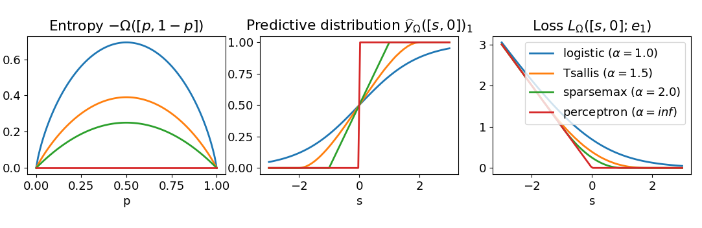

.. -*- mode: rst -*-

Fenchel-Young losses
=====================

This package implements loss functions useful for **probabilistic classification**. More specifically, it provides

* drop-in replacements for PyTorch loss functions
* drop-in replacements for TensorFlow loss functions
* scikit-learn compatible classifiers

The package is based on the **Fenchel-Young loss** framework [1,2,3].

Notice from the center plot that sparsemax and Tsallis are able to produce **exactly zero** (sparse) probabilities unlike the logistic (softmax) loss.

Supported Fenchel-Young losses
------------------------------

* Multinomial logistic loss
* One-vs-all logistic loss
* Sparsemax loss (**sparse** probabilities!)
* Tsallis losses (**sparse** probabilities!)

Sparse means that some classes have exactly zero probability, i.e., these classes are irrelevant.

Tsallis losses are a family of losses parametrized by a positive real value α. They recover the multinomial logistic loss with α=1 and the sparsemax loss with α=2. Values of α between 1 and 2 enable to interpolate between the two losses.

In all losses above, the ground-truth can either be a n_samples 1d-array of **label integers** (each label should be between 0 and n_classes-1) or a n_samples x n_classes 2d-array of **label proportions** (each row should sum to 1).

Examples
---------

scikit-learn compatible classifier:

.. code-block:: python

  import numpy as np
  from sklearn.datasets import make_classification
  from fyl_sklearn import FYClassifier

  X, y = make_classification(n_samples=10, n_features=5, n_informative=3,
                             n_classes=3, random_state=0)
  clf = FYClassifier(loss="sparsemax")
  clf.fit(X, y)
  print(clf.predict_proba(X[:3]))

Drop-in replacement for PyTorch losses:

.. code-block:: python

  import torch
  from fyl_pytorch import SparsemaxLoss

  # integers between 0 and n_classes-1, shape = n_samples
  y_true = torch.tensor([0, 2])
  # model scores, shapes = n_samples x n_classes
  theta = torch.tensor([[-2.5, 1.2, 0.5],
                        [2.2, 0.8, -1.5]])
  loss = SparsemaxLoss()
  # loss value (caution: reversed convention compared to numpy and tensorflow)
  print(loss(theta, y_true))
  # predictions (probabilities) are stored for convenience
  print(loss.y_pred)
  # can also recompute them from theta
  print(loss.predict(theta))
  # label proportions are also allowed
  y_true = torch.tensor([[0.8, 0.2, 0],
                         [0.1, 0.2, 0.7]])
  print(loss(theta, y_true))

Drop-in replacement for tensorflow losses:

.. code-block:: python

  import tensorflow as tf
  from fyl_tensorflow import sparsemax_loss, sparsemax_predict

  # integers between 0 and n_classes-1, shape = n_samples
  y_true = tf.constant([0, 2])
  # model scores, shapes = n_samples x n_classes
  theta = tf.constant([[-2.5, 1.2, 0.5],
                       [2.2, 0.8, -1.5]])
  # loss value
  print(sparsemax_loss(y_true, theta))
  # predictions (probabilities)
  print(sparsemax_predict(theta))
  # label proportions are also allowed
  y_true = tf.constant([[0.8, 0.2, 0],
                        [0.1, 0.2, 0.7]])
  print(sparsemax_loss(y_true, theta))

Installation
------------

Simply copy relevant files to your project.

References
----------

.. [1] *SparseMAP: Differentiable Sparse Structured Inference.*
        Vlad Niculae, André F. T. Martins, Mathieu Blondel, Claire Cardie.
        In Proc. of ICML 2018.
        [`arXiv <https://arxiv.org/abs/1802.04223>`_]

.. [2] *Learning Classifiers with Fenchel-Young Losses: Generalized Entropies, Margins, and Algorithms.*
        Mathieu Blondel, André F. T. Martins, Vlad Niculae.
        In Proc. of AISTATS 2019.
        [`arXiv <https://arxiv.org/abs/1805.09717>`_]
        
.. [3] *Learning with Fenchel-Young Losses.*
        Mathieu Blondel, André F. T. Martins, Vlad Niculae.
        Preprint.
        [`arXiv <https://arxiv.org/abs/1901.02324>`_]
        
Author
------

- Mathieu Blondel, 2018
